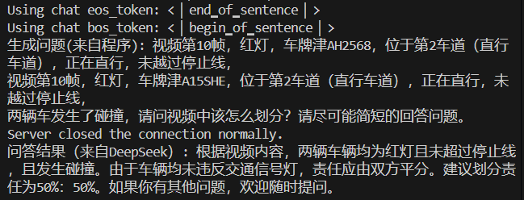
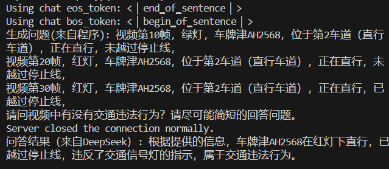
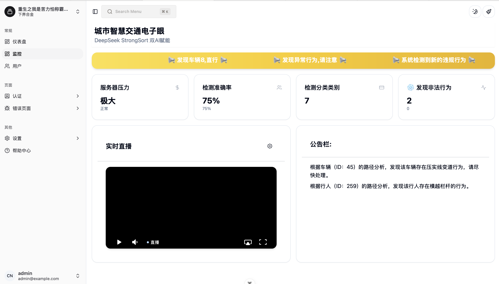
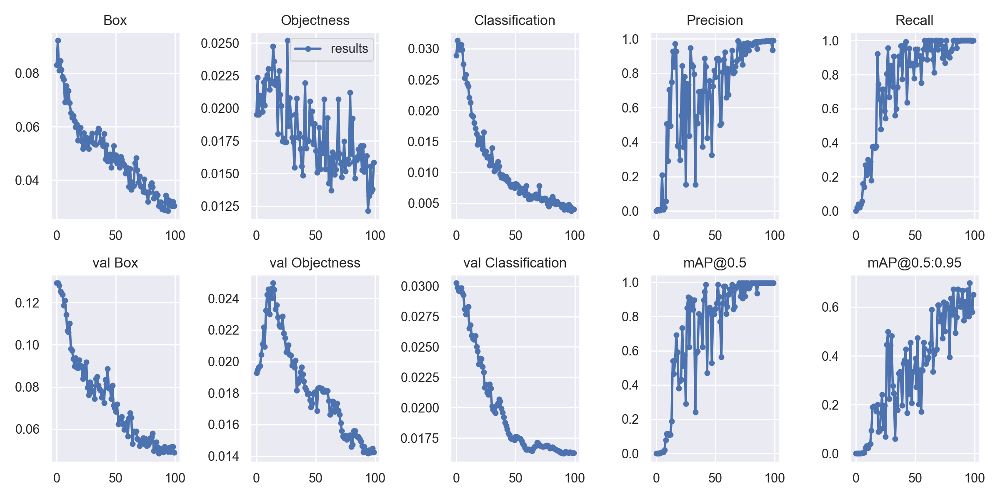
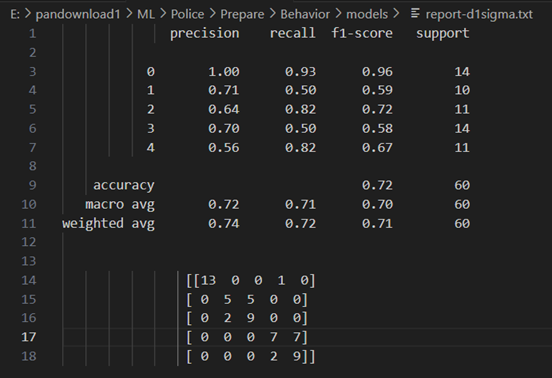
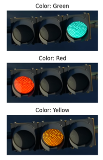

# DeepSeek+StrongSort双AI赋能城市智慧交通电子眼

### 介绍
AI应用项目（仅供实验室模拟）

### 安装教程
工程没有写 requirements.txt 所以如果想要跑 demo 还请找个新人慢慢装

使用的环境是 Python 3.10，还是比较需要技巧的，如果你要跑 StrongSort 原论文的代码你需要 Python 3.7 否则对应版本的 sklearn 装不上

### 使用说明

1.  开启 Deepseek 后端服务器

```
uvicorn deepseek:app --host 0.0.0.0 --port 82 --workers 1
```

开启之后大概是这样的






2.  开启后端 Login 验证服务器 ( 如果用WSGI服务器可能有奇妙的东西出现 )

```
python login.py
```

为什么要这个呢，因为这个内容本身不是为大众开放的，所以为了安全性牺牲了一些了效率，注册每一次的行为，其中用 RandomForest 做了一个基础的检测，可以去看这个项目

https://github.com/hhhhc-da/attack_detection



3.  使用 StrongSort 进行物体跟踪和识别

```
# 可以考虑用本地的视频来模拟验证
python main.py --source E:\pandownload1\ML\Police\Project\source\valid.mp4 --save-vid

# 程序还可以直接拉流并推流
python main.py --source rtmp://192.168.43.234:1935/live/114514 --output rtmp://192.168.43.234:1935/live/1919810 --save-vid
```


而我们的主角 StrongSort 则是输出这些十维数据，不过在最新的工程中我添加了几个维度的信息


4.  项目训练了一个车辆的行为模式识别 ( 直行、左转、右转、静止、掉头 ) 进行了训练，下面是一些数据预处理的图片


之后训练的效果不是很理想，而且在验证视频上 YOLOv7 的默认参数效果不好所以重新训练了一个



之后训练了一个行为预测，F1-score 才 71%，勉强凑合用




5.  红绿灯的检测则是使用将 BGR 转换转换为 HSV 格式实现的掩码色相检测，效果还可以



### 特别鸣谢
1.  YOLOv7 + StrongSort + OSNet 是这个开源项目：

```
# 项目采用 GPL-3.0 协议
https://github.com/mikel-brostrom/Yolov7_StrongSORT_OSNet
```

2.  车牌识别是这个开源项目：

```
# 项目采用 GPL-3.0 协议
https://github.com/we0091234/Chinese_license_plate_detection_recognition
```