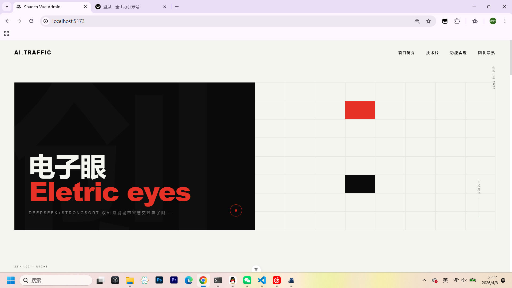
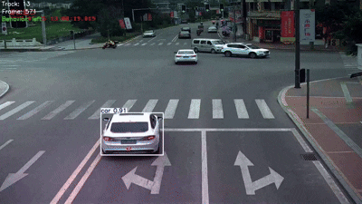
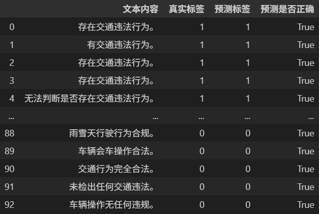
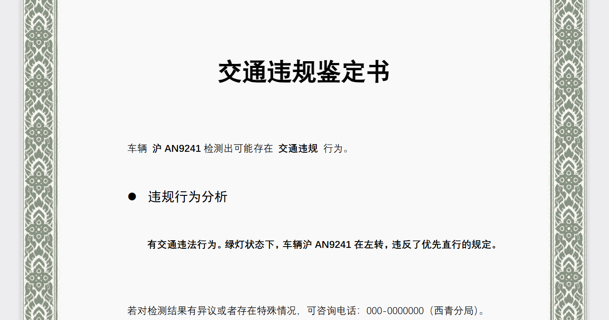
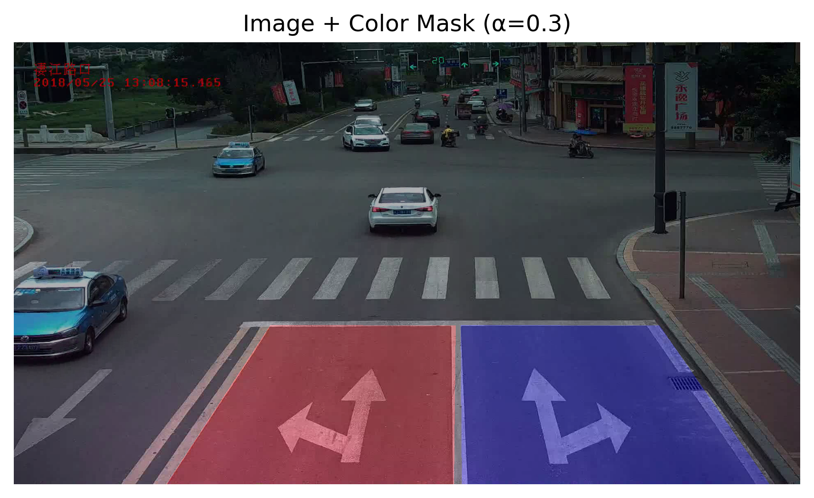
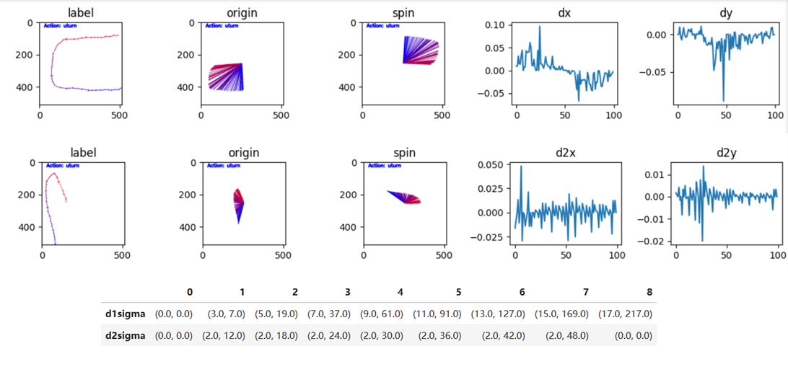
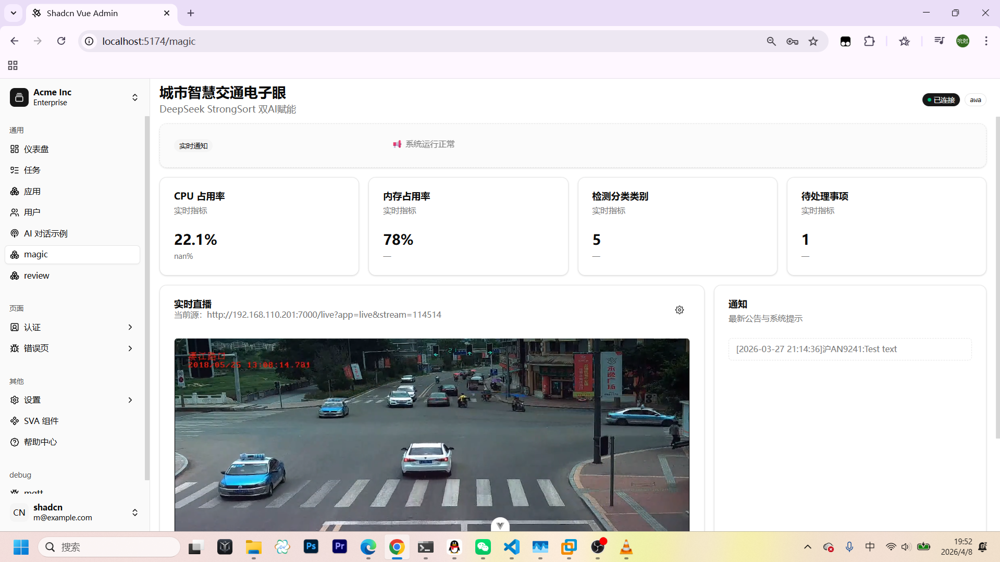
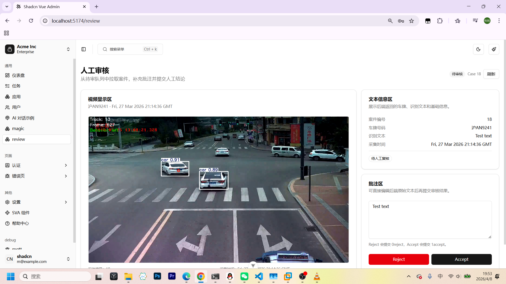

# AI 赋能城市智慧交通电子眼
---

### 介绍



智能应用项目（仅供实验室模拟）, 工程使用的环境是 `Python 3.11.11 Windows 11` 带 `anaconda`，最后出来的检测结果类似于：



### 安装教程
```
# 创建虚拟环境
conda create -n proj python=3.11.11
conda activate proj

# 先安装 tb-nightly，Windows 环境下要单独装，自己找一个版本下载吧
pip install whl\tb_nightly-2.20.0a20250314-py3-none-any.whl

# 然后安装带 CUDA 支持的 PyTorch，不过我建议用 pip 装更省心
conda install pytorch==2.5.1 torchvision==0.20.1 torchaudio==2.5.1 pytorch-cuda=12.1 -c pytorch -c nvidia

# 之后安装 Flash attention，介于我是 RTX 3050 LapTop 不支持就没装
# pip install whl\flash_attn-2.5.8-cp311-cp311-win_amd64.whl

# 之后正常安装 requirements.txt
pip install -r requirements.txt

```

由于他里面需要安装 `llama-cpp-python`，所以我们还需要配置编译环境，我在 `Ubuntu` 下测试有问题，这样解决：

```
# 基本的更新和安装
apt update && apt upgrade -y
apt install build-essential cmake

# 配置编译环境
export CC=/usr/bin/gcc
export CXX=/usr/bin/g++
```

然后呢，你需要去 Release 里下载全部的模型文件，然后覆盖掉 models 内的模型们。

**启动所有文件！！！**

```bash
python initialize.py  # 用于切割车道线掩膜（运行完自动退出）
python loop.py        # 用于开启阻塞式进程（阻塞式运行）
python main.py        # 用于分析视频和输出（运行完自动退出）

# 想测试有没有问题？试试 test.py 吧
python test.py --env        # 仅测试 EnvAnalyzer 是否正常
python test.py --report     # 仅测试 PDF 接口是否正常
```

### 详细内容

我们的项目分为以下几个内容：

#### 1.  NLP 部分

`DeepSeekServe` 后端控制器，用于管理 `Llama-2` 的输出，在此基础上封装 `LargeLanguageModelManager`。

详情可以参考 `modules\agent.py`，有很方便的切换函数，也可以封装进其他的内容。

并且本模块已经被单独拆解：

```bash
git clone https://github.com/hhhhc-da/llm-manager-ethink-export-gpt.git
```

最后使用 `Bert` 进行 `LLM` 输出分类，一般这种级别都上 `Workflow` 了，不过还是坚持了手写，详见 `source\bert`。




#### 2.  Word to PDF

因为我用的是 `Windows` 所以这一部分调用了 `MicroSoft Office` 哦，`Linux` 用户请额外注意。



#### 3.  Video 部分

已经重新编写了 `Video` 部分的推理逻辑, 将 `YOLOv12` 直接封装进了 `modules\processor.py`，反正会的人会自己换成 `ultralytics` 去切换版本的，我就不费那个功夫单独拆出来前置 `Object detection` 模块了。

我们通过视觉算法直接计算出来的车道环境，还是有较强的假设的，如果你换了视频请也一起分析一下（代码来自 `modules.analyzer.EnvAnalyzer`）:

```python
class EnvAnalyzer():
    # 省略很多内容，自己搜索一下这个函数
    def _cv_analyze_lane_info(self):
        '''
        计算车道线信息, 最后输出绘制好的掩膜
        '''
        self._cv_fetch_image( # 读取信息到 self.init_image, 无锁
            path = r'E:\pandownload1\ML\Police\Project\source\lane.jpg', 
            method = 'local'
        )
        # 特征转换和滤波
        threshold = self._cv_feature_convert()
        # 斑马线信息识别, 输出 y 过滤范围
        non_zero_indices = self._cv_zebra_crossing_recognize(threshold)
        # 寻找 lane 信息
        zebra_contours, new_edges = self._cv_find_target_area(threshold, non_zero_indices)
        # 梯形拟合, 寻找目标区域, 输出梯形角点 (可能是 4 或 5 个角点)
        # 如果是 5 个角点, 还需要额外做一些保护措施
        corrected_corners, trapezoid_pts = self._cv_fit_trapezoid(zebra_contours, new_edges)
        # 逆透视变换, 归一化图像特征信息, 准备使用 Inception v3 进行识别
        bird_view = self._cv_image_crop_transform(threshold, corrected_corners, trapezoid_pts)
        # 车道信息识别, 全面识别所有信息, 这一步输入的俯视图应已经是干净的图像数据
        lane_info_list, whole_lane_info_list, final_arrows = self._cv_analyze_marks(bird_view)
        # 使用 Inception v3 进行识别
        preds_idx, preds_conf = self.__run_inception_predict(self.inception_model, final_arrows)
        # 生成我们最终的掩膜数据
        return self._cv_mask_generate(lane_info_list, whole_lane_info_list, preds_idx, preds_conf)
```

处理完 `lane.jpg` 之后就修改特征转换函数 `_cv_feature_convert`，这一步直接决定后续能不能正常分析出来。



后续就是 `YOLOv12` + `StrongSort` + `OSNet` 的常规跟踪了，最后还有一个小目标过滤，需要将屏幕上方的小目标过滤，也是需要衡量后续优化的。

#### 4.  MQTT + SMTP + HTTP 部分，巡检 MySQL

随便写写，反正都封装进去了，`modules\analyzer` 里全是这个封装，总之就是用类去描述各种事务。

#### 5.  瓶颈

1. 计算机视觉切割第一步语义省略与二值化信息转换

2. 这个智障路径分析模型（其实是最近 bro 忙爆了没训）



3. 小目标检测和跟踪区域划定（目前是 0.3y 硬切割）

4. LLM 的检索增强生成处理，没有挂知识库也没有优化 Prompt

别的也就那样了。

#### 6.  程序输出案例

`initialize.py` 输出如下：

```txt
非阻塞启动命令: cmd /c conda activate proj && python modules\analyzer.py --env (PID: 32448)
所有业务任务已后台启动，主程序继续运行...
PID:32448 状态: 运行中
所有后台任务已启动, 准备执行主函数...
所有子进程已退出，主程序退出

# ------------------------- 内部的 log 如下 ------------------------- #
总计检测到 100 行斑马线
发现坐标 264 - 1654, 679 - 1079
左上点：(564.0, 680.0)，左侧边角度：52.98°
右上点：(1569.0, 682.0)，上侧边角度：-0.17°
右下点：(1655.0, 806.0)，右侧边角度：-55.19°
箭头图片 1：预测类别=左前 (索引=0)，置信度=0.9885
箭头图片 2：预测类别=右前 (索引=1)，置信度=0.9858
车道掩膜图像已保存至: E:\pandownload1\ML\Police\Project\.cache\lane.png
```

`loop.py` 输出如下：

```txt
非阻塞启动命令: mosquitto.exe -c mosquitto.conf (PID: 13104)
MQTT 服务已后台启动，2秒后启动其他任务...
非阻塞启动命令: cmd /c npm run dev (PID: 32048)
非阻塞启动命令: cmd /c conda activate proj && python modules\app.py --verbose (PID: 38656)
非阻塞启动命令: cmd /c conda activate proj && python app.py (PID: 28452)
非阻塞启动命令: cmd /c conda activate proj && python monitor.py (PID: 33844)
所有业务任务已后台启动，主程序继续运行...
PID:13104 状态: 运行中
PID:32048 状态: 运行中
PID:38656 状态: 运行中
PID:28452 状态: 运行中
PID:33844 状态: 运行中
所有后台任务已启动，主程序进入循环（按Ctrl+C退出）...

接收到退出信号，开始清理...
已终止进程 PID: 13104
已终止进程 PID: 32048
已终止进程 PID: 38656
已终止进程 PID: 28452
已终止进程 PID: 33844
```

`main.py` 输出如下：

```txt
删除 Redis 存储的旧数据
开始处理 Video 并制作基础切片
Model: osnet_x0_25
- params: 203,568
- flops: 82,316,000
Successfully loaded pretrained weights from "E:\pandownload1\ML\Police\Project\models\osnet_x0_25_msmt17.pt"
** The following layers are discarded due to unmatched keys or layer size: ['classifier.weight', 'classifier.bias']
(1, 256, 128, 3)
{'ECC': False, 'MC_LAMBDA': 0.5, 'EMA_ALPHA': 0.9, 'MAX_DIST': 0.7, 'MAX_IOU_DISTANCE': 0.5, 'MAX_AGE': 5, 'N_INIT': 20, 'NN_BUDGET': 100}

---------------------- StrongSort 初始化报告 ----------------------
                                                        StrongSort
init time                                      2026-03-25 19:45:50
max det                                                       1000
device                                                      cuda:0
save directory    E:\pandownload1\ML\Police\Project\runs\track\exp
ecc                                                          False
mc lambda                                                      0.5
ema alpha                                                      0.9
max dist                                                       0.7
max iou distance                                               0.5
max age                                                          5
n init                                                          20
nn budget                                                      100
YOLO 模型加载完成：设备=cuda:0 | 置信度阈值=0.7
Redis 连接响应成功
文件信息 - 总帧数: 1077 | 实际帧率: 25.00fps | 总切片数: 5 | 每切片帧数: 250
捕获进程启动成功 | 分辨率: 1920x1080 | 帧率: 25.00 | 源类型: 文件
切片 0 保存进程启动成功 (PID: 12260) -> runs\live\stream_000000.mp4
开始处理 | 推流: 关闭 | 保存: 开启 | 切片配置: 每 10 秒 / 250 帧一个切片 | 按 Ctrl+C 停止处理
处理切片 0/5: 100%|█████████████████████████████████████████████████████████| 250/250 [00:25<00:00,  9.62帧/s, color_code=2]
切片 0 处理完成 (累计帧数: 250)
处理切片 1/5:   0%|                                                                                 | 0/250 [00:00<?, ?帧/s] 进程 (PID: 12260) 已正常关闭
切片 1 保存进程启动成功 (PID: 29988) -> runs\live\stream_000001.mp4
处理切片 1/5: 100%|█████████████████████████████████████████████████████████| 250/250 [00:22<00:00, 11.25帧/s, color_code=2]
切片 1 处理完成 (累计帧数: 500)
处理切片 2/5:   0%|                                                                                 | 0/250 [00:00<?, ?帧/s] 进程 (PID: 29988) 已正常关闭
切片 2 保存进程启动成功 (PID: 34356) -> runs\live\stream_000002.mp4
处理切片 2/5: 100%|█████████████████████████████████████████████████████████| 250/250 [00:24<00:00, 10.19帧/s, color_code=2] 
切片 2 处理完成 (累计帧数: 750)
处理切片 3/5:   0%|                                                                                 | 0/250 [00:00<?, ?帧/s] 进程 (PID: 34356) 已正常关闭
切片 3 保存进程启动成功 (PID: 36188) -> runs\live\stream_000003.mp4
处理切片 3/5: 100%|█████████████████████████████████████████████████████████| 250/250 [00:16<00:00, 15.15帧/s, color_code=0]
切片 3 处理完成 (累计帧数: 1000)
处理切片 4/5:   0%|                                                                                 | 0/250 [00:00<?, ?帧/s] 进程 (PID: 36188) 已正常关闭
切片 4 保存进程启动成功 (PID: 13196) -> runs\live\stream_000004.mp4
处理切片 4/5:  31%|██████████████████                                        | 78/250 [00:05<00:11, 15.27帧/s, color_code=0]
最后一个切片 4 处理完成 (累计帧数: 1077)
进程 (PID: 13196) 已正常关闭
视频文件处理完成
处理统计 - 总帧数: 1077 | 总切片数: 5
开始执行分析与预测
Redis 连接成功

---------------------- BehaviorAnalyzer 运行报告 ----------------------
                                  BehaviorAnalyzer
method                                        deep
classifier                   _core_Behavior_Module
model_path  models\behavior_model_d1sigma_silu.pth
device                                      cuda:0
label           STOP, LEFT, STRAIGHT, RIGHT, UTURN
成功加载 Prompt 模板: 
[{'role': 'system', 'content': '你是一个专业的智能助手，回答简洁、准确，只说中文，字数限制在100字以内。'}]

模型运行在 cuda:0 上
Loading weights: 100%|████████████████████| 199/199 [00:00<00:00, 2809.52it/s, Materializing param=bert.pooler.dense.weight]
BertForSequenceClassification LOAD REPORT from: bert-base-chinese
Key                                        | Status     |
-------------------------------------------+------------+-
cls.predictions.transform.dense.weight     | UNEXPECTED |
cls.predictions.transform.dense.bias       | UNEXPECTED |
cls.seq_relationship.weight                | UNEXPECTED |
cls.seq_relationship.bias                  | UNEXPECTED |
cls.predictions.transform.LayerNorm.weight | UNEXPECTED |
cls.predictions.transform.LayerNorm.bias   | UNEXPECTED |
cls.predictions.bias                       | UNEXPECTED |
classifier.weight                          | MISSING    |
classifier.bias                            | MISSING    |

Notes:
- UNEXPECTED    :can be ignored when loading from different task/architecture; not ok if you expect identical arch.
- MISSING       :those params were newly initialized because missing from the checkpoint. Consider training on your downstream task.

---------------------- ReportExporter 运行报告 ----------------------
                                                      ReportExporter
output_dir                                              runs\reports
supported_formats                                               docx
items              datetime_report, plate, report, administrator,...

-------------------- 开始复制 Redis 备份轨迹数据 --------------------
管道批量复制 12 条数据完成

-------------------- 开始读取 Redis 轨迹数据 --------------------
Redis 列表中共有 12 条数据待处理
轨迹 1 新增 112 个坐标点，累计 112 个
轨迹 1 帧范围：24 ~ 135
轨迹 6 新增 149 个坐标点，累计 149 个
轨迹 6 帧范围：62 ~ 210
轨迹 7 新增 85 个坐标点，累计 85 个
轨迹 7 帧范围：212 ~ 296
轨迹 8 新增 108 个坐标点，累计 108 个
轨迹 8 帧范围：315 ~ 422
轨迹 11 新增 65 个坐标点，累计 65 个
轨迹 11 帧范围：440 ~ 504
轨迹 9 新增 145 个坐标点，累计 145 个
轨迹 9 帧范围：404 ~ 548
轨迹 12 新增 47 个坐标点，累计 47 个
轨迹 12 帧范围：525 ~ 571
轨迹 13 新增 92 个坐标点，累计 92 个
轨迹 13 帧范围：571 ~ 662
轨迹 15 新增 66 个坐标点，累计 66 个
轨迹 15 帧范围：608 ~ 673
轨迹 20 新增 60 个坐标点，累计 60 个
轨迹 20 帧范围：698 ~ 757
轨迹 23 新增 47 个坐标点，累计 47 个
轨迹 23 帧范围：745 ~ 791
轨迹 24 新增 70 个坐标点，累计 70 个
轨迹 24 帧范围：925 ~ 994
处理完成 | 共读取 12 条 Redis 记录 | 聚合得到 12 条完整轨迹

-------------------- 轨迹有效性校验 --------------------
√ 有效 | 轨迹    1 | 起点区域: 红色车道 (1)     | 轨迹长度: 112 | 帧范围: 24~135
√ 有效 | 轨迹    6 | 起点区域: 红色车道 (1)     | 轨迹长度: 149 | 帧范围: 62~210
X 无效 | 轨迹    7 | 起点区域: 无效区域 (0)     | 轨迹长度:  85 | 帧范围: 212~296
X 无效 | 轨迹    8 | 起点区域: 无效区域 (0)     | 轨迹长度: 108 | 帧范围: 315~422
X 无效 | 轨迹   11 | 起点区域: 无效区域 (0)     | 轨迹长度:  65 | 帧范围: 440~504
√ 有效 | 轨迹    9 | 起点区域: 红色车道 (1)     | 轨迹长度: 145 | 帧范围: 404~548
X 无效 | 轨迹   12 | 起点区域: 无效区域 (0)     | 轨迹长度:  47 | 帧范围: 525~571
√ 有效 | 轨迹   13 | 起点区域: 红色车道 (1)     | 轨迹长度:  92 | 帧范围: 571~662
√ 有效 | 轨迹   15 | 起点区域: 红色车道 (1)     | 轨迹长度:  66 | 帧范围: 608~673
X 无效 | 轨迹   20 | 起点区域: 无效区域 (0)     | 轨迹长度:  60 | 帧范围: 698~757
X 无效 | 轨迹   23 | 起点区域: 无效区域 (0)     | 轨迹长度:  47 | 帧范围: 745~791
X 无效 | 轨迹   24 | 起点区域: 无效区域 (0)     | 轨迹长度:  70 | 帧范围: 925~994

-------------------- 生成 LSTM 输入特征 --------------------
特征生成完成 | 特征形状: torch.Size([5, 99, 2]) (样本数, 序列长度, 特征维度)

-------------------- LSTM 行为分类结果 --------------------
轨迹ID:    1 | 起点车道: 红色车道 (1) | 行为类型: straight | 类别码: 2 | 帧范围: 925~135
轨迹ID:    6 | 起点车道: 红色车道 (1) | 行为类型: straight | 类别码: 2 | 帧范围: 925~210
轨迹ID:    9 | 起点车道: 红色车道 (1) | 行为类型: straight | 类别码: 2 | 帧范围: 925~548
轨迹ID:   13 | 起点车道: 红色车道 (1) | 行为类型:     left | 类别码: 1 | 帧范围: 925~662
轨迹ID:   15 | 起点车道: 红色车道 (1) | 行为类型:     stop | 类别码: 0 | 帧范围: 925~673

-------------------- 分析结果预览 --------------------
track_id  start_lane  behavior_code  start_frame  end_frame
       1           1              2           24        135
       6           1              2           62        210
       9           1              2          404        548
      13           1              1          571        662
      15           1              0          608        673
                                        question
0  请问这辆车在绿灯状态下位于可直行可左转车道且正在直行中，有无交通违法行为？请简要说明理由。
1  请问这辆车在绿灯状态下位于可直行可左转车道且正在直行中，有无交通违法行为？请简要说明理由。
2  请问这辆车在绿灯状态下位于可直行可左转车道且正在直行中，有无交通违法行为？请简要说明理由。
3  请问这辆车在绿灯状态下位于可直行可左转车道且正在左转中，有无交通违法行为？请简要说明理由。
4  请问这辆车在绿灯状态下位于可直行可左转车道且正在静止中，有无交通违法行为？请简要说明理由。
开始询问 ChatGLM: 请问这辆车在绿灯状态下位于可直行可左转车道且正在直行中，有无交通违法行为？请简要说明理由。
ChatGLM 回复信息: 无交通违法行为。绿灯状态下，车辆沪AN9241在可直行可左转车道直行，符合交通信号指示，不违反交通规则。 

开始询问 ChatGLM: 请问这辆车在绿灯状态下位于可直行可左转车道且正在直行中，有无交通违法行为？请简要说明理由。
ChatGLM 回复信息: 无交通违法行为。绿灯状态下，车辆沪AN9241在可直行可左转车道直行符合交通规则。 

开始询问 ChatGLM: 请问这辆车在绿灯状态下位于可直行可左转车道且正在直行中，有无交通违法行为？请简要说明理由。
ChatGLM 回复信息: 无交通违法行为。根据交通规则，绿灯状态下，位于可直行可左转车道内，车辆沪AN9241在直行中符合规定。 

开始询问 ChatGLM: 请问这辆车在绿灯状态下位于可直行可左转车道且正在左转中，有无交通违法行为？请简要说明理由。
ChatGLM 回复信息: 有交通违法行为。绿灯状态下，车辆沪AN9241在左转，违反了优先直行的规定。 

开始询问 ChatGLM: 请问这辆车在绿灯状态下位于可直行可左转车道且正在静止中，有无交通违法行为？请简要说明理由。
ChatGLM 回复信息: 无交通违法行为。绿灯状态下，车辆沪AN9241在可直行可左转车道静止，未违反交通信号灯规定，也未占用不应占用的车 道。


(Zhipuai) 询问结果:
                                               reply
0  无交通违法行为。绿灯状态下，车辆沪AN9241在可直行可左转车道直行，符合交通信号指示，不违...
1          无交通违法行为。绿灯状态下，车辆沪AN9241在可直行可左转车道直行符合交通规则。
2  无交通违法行为。根据交通规则，绿灯状态下，位于可直行可左转车道内，车辆沪AN9241在直行中...
3             有交通违法行为。绿灯状态下，车辆沪AN9241在左转，违反了优先直行的规定。
4  无交通违法行为。绿灯状态下，车辆沪AN9241在可直行可左转车道静止，未违反交通信号灯规定，...

违规视频导出成功：runs\live\ext\violation_227208112977783231_13_left.mp4

PDF 文件已保存: runs\reports\沪AN9241-13-违规报告-2026-03-25-19-47-51.pdf


-------------------- 违规视频列表 --------------------
车牌: 沪AN9241 | 轨迹ID: 13 | 行为: left | 视频: runs\live\ext\violation_227208112977783231_13_left.mp4
```


### 特别鸣谢

|名称|开源协议|链接|
|----|----|----|
|目标跟踪|GPL-3.0|https://github.com/mikel-brostrom/Yolov7_StrongSORT_OSNet|
|车牌识别|GPL-3.0|https://github.com/we0091234/Chinese_license_plate_detection_recognition|
|目标检测|APGL-3.0|https://github.com/sunsmarterjie/yolov12|
|车道线拟合|MIT|https://github.com/lucastabelini/PolyLaneNet|
|前端页面|MIT|https://github.com/satnaing/shadcn-admin|




