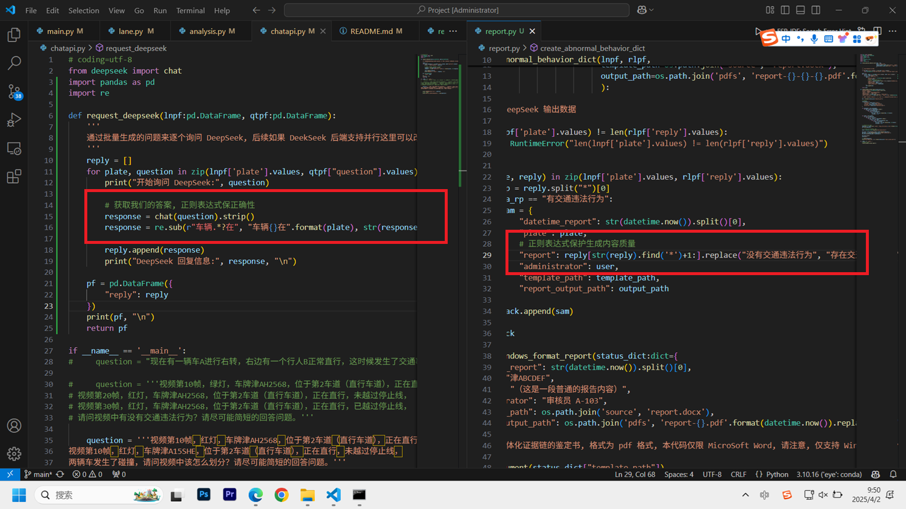

# DeepSeek+StrongSort双AI赋能城市智慧交通电子眼

### 介绍
AI应用项目 （仅供实验室模拟）


上面是整个项目的图解

### 使用说明

#### 1.  项目正式接入了 Prompt 的生成和 DeepSeek 交互, 预计未来还要接入 Bert 进行分类


程序内其实还是有一些技巧的，比如关键信息抽取



#### 2.  项目最后会根据分类结果生成一个证书


#### 3.  使用 StrongSort 进行物体跟踪和识别

```
# 可以考虑用本地的视频来模拟验证 (由于大多数改成了绝对路径所以建议这里使用相对路径)
python main.py --source source\valid.mp4 --save-vid

# 程序还可以直接拉流并推流
python main.py --source rtmp://192.168.43.234:1935/live/114514 --output rtmp://192.168.43.234:1935/live/1919810 --save-vid
```


而我们的主角 StrongSort 则是输出这些数据，不过在最新的工程中我添加了几个维度的信息


#### 4.  项目的车道线识别完全是基于计算机图形学做的， 建议对接到 PolyLaneNet 这种多项式拟合网络，我提供了对接二次函数的接口


这个可以掩膜绘制我们感兴趣的部分, 具体应用到工程里的话就是这样的


红绿灯的检测则是使用将 BGR 转换转换为 HSV 格式实现的掩码色相检测，效果还可以, 在项目内还有一个状态转移的控制


#### 5.  开启 Deepseek 后端服务器

```
# 开启后端服务器
python modules\deepseek.py

# 测试我们的后端
python modules\chatapi.py
```

开启之后大概是这样的


#### 6.  开启后端 Login 验证服务器 ( 如果用WSGI服务器可能有奇妙的东西出现 )

```
# 后端服务
python modules\login.py

# 分析我们的行为
python modules\analysis.py
```

为什么要这个呢，因为这个内容本身不是为大众开放的，所以为了安全性牺牲了一些了效率，注册每一次的行为，其中用 RandomForest 做了一个基础的检测，可以去看这个项目

<p><strong>基于随机森林算法的网络攻击检测案例 https://github.com/hhhhc-da/attack_detection</strong><p>


#### 7.  项目训练了一个车辆的行为模式识别 ( 直行、左转、右转、静止、掉头 ) 进行了训练，下面是一些数据预处理的图片


之后训练的效果不是很理想，而且在验证视频上 YOLOv7 的默认参数效果不好所以重新训练了一个


之后训练了一个行为预测，F1-score 才 75%，勉强凑合用


#### 8.  程序输出案例
```

E:\pandownload1\COMPUTER\Anaconda\envs\eye\lib\site-packages\torchreid\reid\metrics\rank.py:11: UserWarning: Cython evaluation (very fast so highly recommended) is unavailable, now use python evaluation.
  warnings.warn(

# LLama 的输出信息
llama_model_loader: loaded meta data with 30 key-value pairs and 339 tensors from E:\pandownload1\ML\Police\Project\models\DeepSeek-R1-Distill-Qwen-1.5B-Q8_0.gguf (version GGUF V3 (latest))
llama_model_loader: Dumping metadata keys/values. Note: KV overrides do not apply in this output.
llama_model_loader: - kv   0:                       general.architecture str              = qwen2
llama_model_loader: - kv   1:                               general.type str              = model
(---------------------------------超级繁琐我就省略了---------------------------------)


第一帧已保存为: E:\pandownload1\ML\Police\Project\.cache\lane.jpg

# YOLOv7 输出信息
YOLOR  acd1bf0 torch 2.5.1 CUDA:0 (NVIDIA GeForce RTX 3050 Laptop GPU, 4095.5MB)
(---------------------------------超级繁琐我就省略了---------------------------------)

图片大小为: 540 x 720

            class                                        box      conf
0        straight   [0.664815, 0.866667, 0.037037, 0.197222]  0.669922
1      cross-line   [0.506481, 0.636111, 0.587037, 0.102778]  0.716309
2      cross-line  [0.501852, 0.296528, 0.581481, 0.0986111]  0.753906
3   left-straight  [0.325926, 0.865278, 0.0777778, 0.211111]  0.768066
4  traffic-lights   [0.215741, 0.136806, 0.431481, 0.126389]  0.921875

        num_ways
YOLOv7         2
OpenCV         3 

预测车道线 HIT 区域 x = [34, 270, 507]
  px_stop_line
0    x = 34.00
1   x = 270.50
2   x = 507.00
共归类出 3 条车道线

  px_stop_line
0   y = 495.00
1   y = 178.00
停止线预测位置在 y = 495.00

车道线掩码已保存至 E:\pandownload1\ML\Police\Project\.cache\mask_lane.jpg 

YOLOv7 + StrongSort 跟踪后共有 6 个轨迹

    ID           lane  behavior   judge    plate
0  1.0       straight  straight  Normal  津ABCDEF
1  2.0       straight  straight  Normal  津ABCDEF
2  3.0       straight  straight  Normal  津ABCDEF
3  4.0  left-straight      left  Normal  津ABCDEF
4  5.0       straight  straight  Normal  津ABCDEF
5  6.0  left-straight      left  Normal  津ABCDEF 

                                            question
0  视频第12到119帧，绿灯，车牌津ABCDEF，位于直行车道，正在直行。\n请问视频中有没有...
1  视频第146到253帧，红灯，车牌津ABCDEF，位于直行车道，正在直行。\n请问视频中有没...
2  视频第295到372帧，红灯，车牌津ABCDEF，位于直行车道，正在直行。\n请问视频中有没...
3  视频第411到467帧，红灯，车牌津ABCDEF，位于直行和左转车道，正在左转。\n请问视频...
4  视频第520到597帧，绿灯，车牌津ABCDEF，位于直行车道，正在直行。\n请问视频中有没...
5  视频第636到692帧，绿灯，车牌津ABCDEF，位于直行和左转车道，正在左转。\n请问视频...

开始询问 DeepSeek: 视频第12到119帧，绿灯，车牌津ABCDEF，位于直行车道，正在直行。
请问视频中有没有交通违法行为？请尽可能简短的回答问题。
DeepSeek 回复信息: 没有交通违法行为*根据提供的信息，车辆津ABCDEF在直行车道内、绿灯下直行，没有交通违法行为。如果你有其他问题，欢迎随时提问。 

开始询问 DeepSeek: 视频第146到253帧，红灯，车牌津ABCDEF，位于直行车道，正在直行。
请问视频中有没有交通违法行为？请尽可能简短的回答问题。
DeepSeek 回复信息: 有交通违法行为*根据提供的信息，车辆津ABCDEF在直行车道内、红灯下直行，属于闯红灯，有交通违法行为。如果你有其他问题，欢迎随时提问。 

开始询问 DeepSeek: 视频第295到372帧，红灯，车牌津ABCDEF，位于直行车道，正在直行。
请问视频中有没有交通违法行为？请尽可能简短的回答问题。
DeepSeek 回复信息: 没有交通违法行为*根据提供的信息，车辆津ABCDEF在直行车道内、绿灯下直行，没有交通违法行为。如果你有其他问题，欢迎随时提问。 

开始询问 DeepSeek: 视频第411到467帧，红灯，车牌津ABCDEF，位于直行和左转车道，正在左转。
请问视频中有没有交通违法行为？请尽可能简短的回答问题。
DeepSeek 回复信息: 有交通违法行为*根据提供的信息，车辆津ABCDEF在直行车道和左转车道内、红灯下左转，属于闯红灯，有交通违法行为。如果你有其他问题，欢迎随时提问。 

开始询问 DeepSeek: 视频第520到597帧，绿灯，车牌津ABCDEF，位于直行车道，正在直行。
请问视频中有没有交通违法行为？请尽可能简短的回答问题。
DeepSeek 回复信息: 没有交通违法行为*根据提供的信息，车辆津ABCDEF在直行车道内、绿灯下直行，没有交通违法行为。如果你有其他问题，欢迎随时提问。 

开始询问 DeepSeek: 视频第636到692帧，绿灯，车牌津ABCDEF，位于直行和左转车道，正在左转。
请问视频中有没有交通违法行为？请尽可能简短的回答问题。
DeepSeek 回复信息: 没有交通违法行为*根据提供的信息，车辆津ABCDEF在直行车道和左转车道内、绿灯下左转，没有交通违法行为。如果你有其他问题，欢迎随时提问。 

                                               reply
0  没有交通违法行为*根据提供的信息，车辆津ABCDEF在直行车道内、绿灯下直行，没有交通违法行...
1  有交通违法行为*根据提供的信息，车辆津ABCDEF在直行车道内、红灯下直行，属于闯红灯，有交...
2  没有交通违法行为*根据提供的信息，车辆津ABCDEF在直行车道内、绿灯下直行，没有交通违法行...
3  有交通违法行为*根据提供的信息，车辆津ABCDEF在直行车道和左转车道内、红灯下左转，属于闯...
4  没有交通违法行为*根据提供的信息，车辆津ABCDEF在直行车道内、绿灯下直行，没有交通违法行...
5  没有交通违法行为*根据提供的信息，车辆津ABCDEF在直行车道和左转车道内、绿灯下左转，没有...

                                         report_name
0  report-2025-04-02 11-06-33.263063-d1c471dd-7ef...
1  report-2025-04-02 11-06-33.263063-ce7b2eb7-782...

PDF 文件已保存: E:\pandownload1\ML\Police\Project\pdfs\report-2025-04-02 11-06-33.263063-d1c471dd-7ef6-4a13-99da-432bc9febd98.pdf

PDF 文件已保存: E:\pandownload1\ML\Police\Project\pdfs\report-2025-04-02 11-06-33.263063-ce7b2eb7-7821-4c37-902a-00c22346c32c.pdf

```

### 安装教程
工程使用的环境是 Python 3.10.16 Windows 11 带 conda

```
# 创建虚拟环境
conda create -n eye python=3.10.16
conda activate eye

# 先安装 tb-nightly
pip install tb_nightly-2.20.0a20250314-py3-none-any.whl

# 之后正常安装 requirements.txt 和 torch CUDA
pip install -r requirements.txt
conda install pytorch==2.5.1 torchvision==0.20.1 torchaudio==2.5.1 pytorch-cuda=12.1 -c pytorch -c nvidia
```

由于他里面需要安装 llama-cpp-python，所以我们还需要配置编译环境，我在 Ubuntu 下测试有问题，这样解决

```
# 基本的更新和安装
apt update && apt upgrade -y
apt install build-essential cmake

# 配置编译环境
export CC=/usr/bin/gcc
export CXX=/usr/bin/g++
```

然后呢，你需要去 Release 里下载全部的模型文件，因为太大了所以不放在源码这里了


### 特别鸣谢
#### 1.  YOLOv7 + StrongSort + OSNet

```
# 项目采用 GPL-3.0 协议
https://github.com/mikel-brostrom/Yolov7_StrongSORT_OSNet
```

#### 2.  车牌识别

```
# 项目采用 GPL-3.0 协议
https://github.com/we0091234/Chinese_license_plate_detection_recognition
```